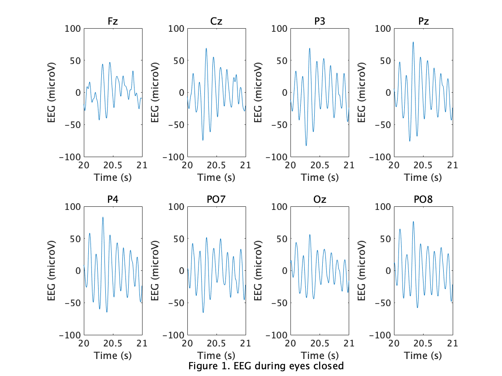
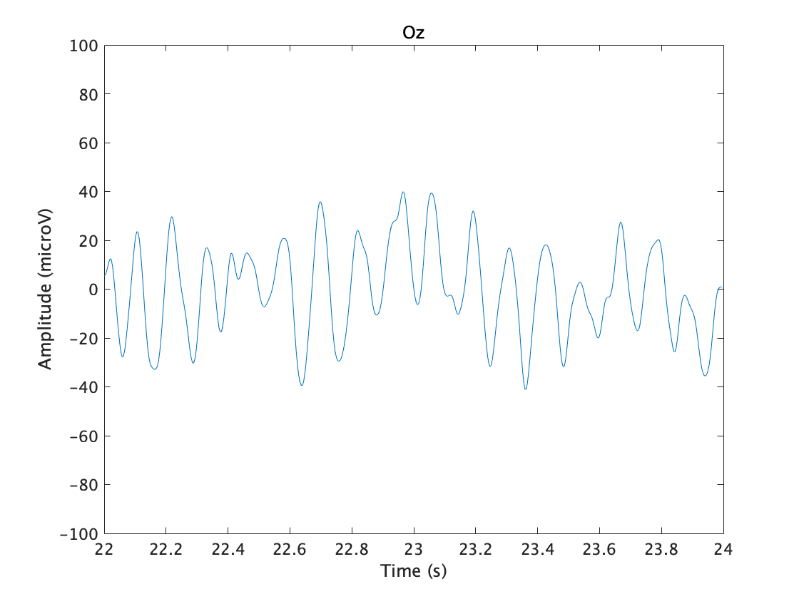
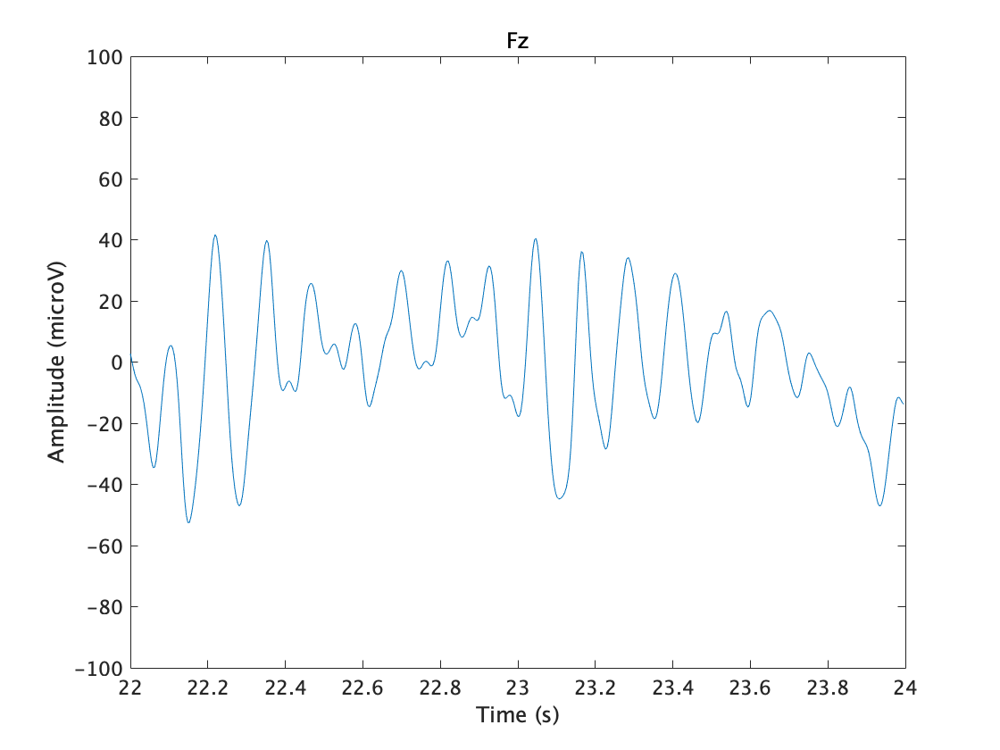
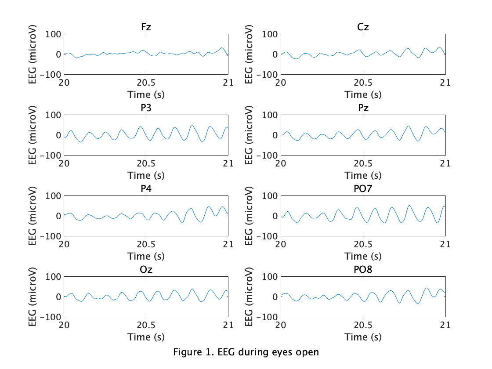

# Lecture1 2021-10-04

 I made a frequency analyzer of brain waves with a window size of 1000ms and a slide size of 500ms.　　
 

  
 
``` EEG-fft-analyzer.py
import matplotlib.pyplot as plt
from matplotlib.animation import FuncAnimation
import numpy as np
import scipy.io as io
import pandas as pd

data = io.loadmat('../EEG-sample/close.mat')
showdata = data['y']
print(showdata.shape)


fig = plt.figure(figsize=(10, 15))
axt = plt.subplot2grid((9, 2), (0, 0), colspan=2)
for i in range(8):
    axt.plot(showdata[0], showdata[i+1])
axt.set_xlabel('Time', fontsize=10)
axt.set_ylabel('EEG (microV)', fontsize=10)
fig.subplots_adjust(wspace=0.2, hspace=2.8)
axt_title = axt.set_title('', size=15)

rate = 256
Windowsize_ms = 1000
N = np.int64(rate*(Windowsize_ms/1000))
dt = 1/rate
period = 128

x = showdata[0]
x = range(len(x))
times = list(map(lambda i: i/rate, x))
start_point = np.int64(N/2)
end_point = np.int64(len(x)-N/2+0.5)

i = 0
ax = {}
start_line = {}
end_line = {}
line = {}
y = {}

for q in range(16):
    if(q < 8):
        ax[q] = plt.subplot2grid((9, 2), (q+1, 0))
        y[q] = showdata[q+1]
        line[q] = ax[q].plot(x, y[q])
        ax[q].set_ylim([-150, 150])
        ax[q].set_xlabel('Number of data', fontsize=8)
        ax[q].set_ylabel('EEG (microV)', fontsize=8)
        ax[q].set_title('{}ch'.format(i+1), fontsize=8)
        start_line[q], = ax[q].plot([x[0], x[0]], [-150, 150], linestyle='dashed', color='red', zorder=10)
        end_line[q], = ax[q].plot([x[N], x[N]], [-150, 150], linestyle='dashed', color='red', zorder=10)
        i = i+1
    else:
        ax[q] = plt.subplot2grid((9, 2), (q-7, 1))
        exec("fft_line%d,= ax[%d].plot([],[])" %(q, q))
        ax[q].set_xlim(0, 1/dt/2)
        ax[q].set_ylim(0, 80)
        ax[q].set_xlabel('Frequency[Hz]', size=8)
        ax[q].set_ylabel('Ampitude', size=8)
    fig.subplots_adjust(wspace=0.3, hspace=1.2)

y[1]


def update(i):
    axt_title.set_text('EEG during eyes close \n Start point ='+str(int(i-N/2))+'     End point = '+str(int(i+N/2)))

    for s in range(8):
        start_line[s].set_xdata([x[np.int64(i-N/2)], x[np.int64(i-N/2)]])
        end_line[s].set_xdata([x[np.int64(i+N/2)], x[np.int64(i+N/2)]])
        y_data = y[s]
        y_data = y_data[np.int64(i-N/2):np.int64(i+N/2)]
        F = np.fft.fft(y_data)
        freq = np.fft.fftfreq(N, d=1/rate)
        amp = np.abs(F/(N/2))
        freq = freq[:int(N/2)]
        amp = amp[:int(N/2)]
        ss = s+8
        exec("fft_line%d.set_xdata(freq)" %(ss))
        exec("fft_line%d.set_ydata(amp)" %(ss))


ani = FuncAnimation(fig, update, frames=np.arange(start_point, end_point, period), interval=100, repeat=True)
ani.save("image/eeg-analyzer.gif", writer="imagemagick")
plt.show()
```


## Task1


``` task1_2.m
%%% Task1
load('../EEG-sample/close.mat');
closeEEG=y(:,256*10+1:length(y));

tt=256*10+1:256*11;
Ch ={'Fz', 'Cz', 'P3', 'Pz', 'P4', 'PO7','Oz','PO8'};
figure(1);
for ii = 1:8
    subplot(2,4,ii);
    plot(closeEEG(1,tt), closeEEG(ii+1,tt));
    xlabel('Time (s)');
    ylabel('EEG (microV)');
    ylim([-100, 100]);
    title(Ch{ii});
end

annotation('textbox', [0.28, 0.001, 0.5, 0.05], ...
           'String', 'Figure 1. EEG during eyes closed', ...
           'HorizontalAlignment', 'center', ...
           'VerticalAlignment', 'middle', ...
           "lineStyle", 'none');

...
```

## Task2
  
 
  


``` task1_2.m
....
%%%  Task2
%(2)
Ch ={'Fz', 'Cz', 'P3', 'Pz', 'P4', 'PO7','Oz','PO8'};
d1=EEGplot_task2(closeEEG, Ch, [12, 14], 7, 2);
d2=EEGplot_task2(closeEEG, Ch, [12, 14], 1, 3);

%(1)
function data = EEGplot_task2(closeEEG, Ch, timeRange, channel, figNo)
tt=256*timeRange(1)+1:256*timeRange(2);
data = closeEEG(channel+1, tt);
figure(figNo);
plot(closeEEG(1, tt), data);
xlabel('Time (s)');
ylabel('Amplitude (microV)');
ylim([-100,100]);
title(Ch{channel})
end
```

## Task3
  
 
``` task3.m
...
%%%  Task3
load('../EEG-sample/open.mat');
closeEEG=y(:,256*10+1:length(y));
Ch ={'Fz', 'Cz', 'P3', 'Pz', 'P4', 'PO7','Oz','PO8'};
figure(4);
for ii = 1:8
    subplot(4,2,ii);
    plot(closeEEG(1,tt), closeEEG(ii+1,tt));
    xlabel('Time (s)');
    ylabel('EEG (microV)');
    ylim([-100, 100]);
    title(Ch{ii});
end
annotation('textbox', [0.25, 0.02, 0.5, 0.05], ...
           'String', 'Figure 1. EEG during eyes open', ...
           'HorizontalAlignment', 'center', ...
           'VerticalAlignment', 'middle', ...
           "lineStyle", 'none');
```
