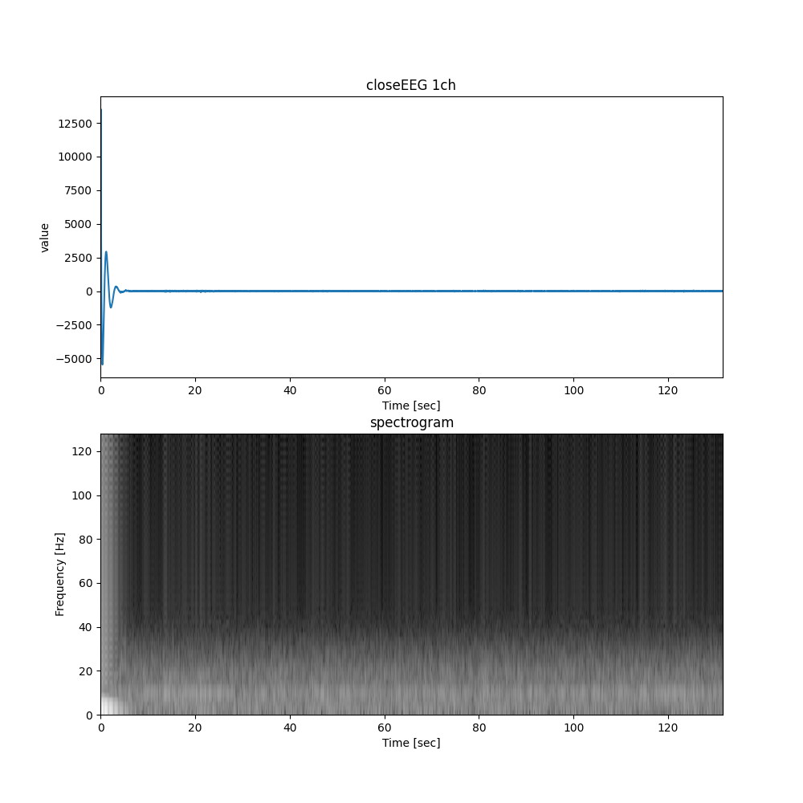
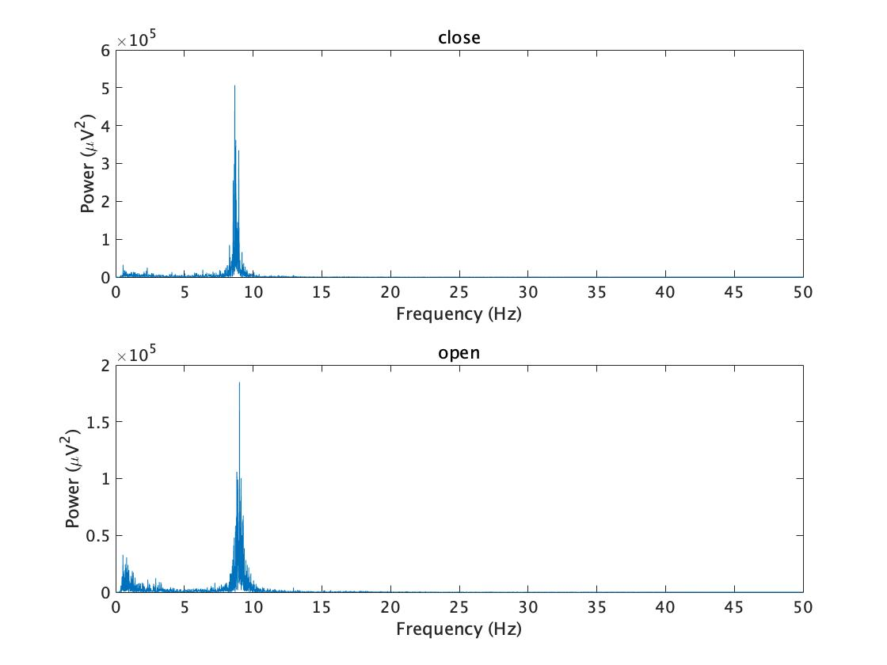
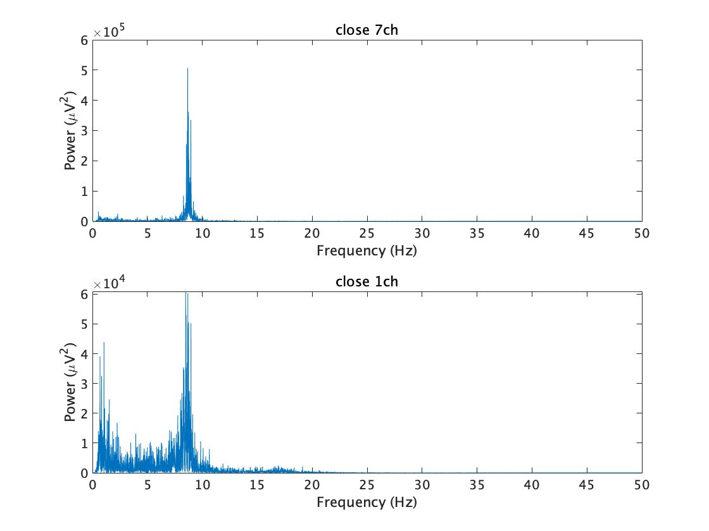
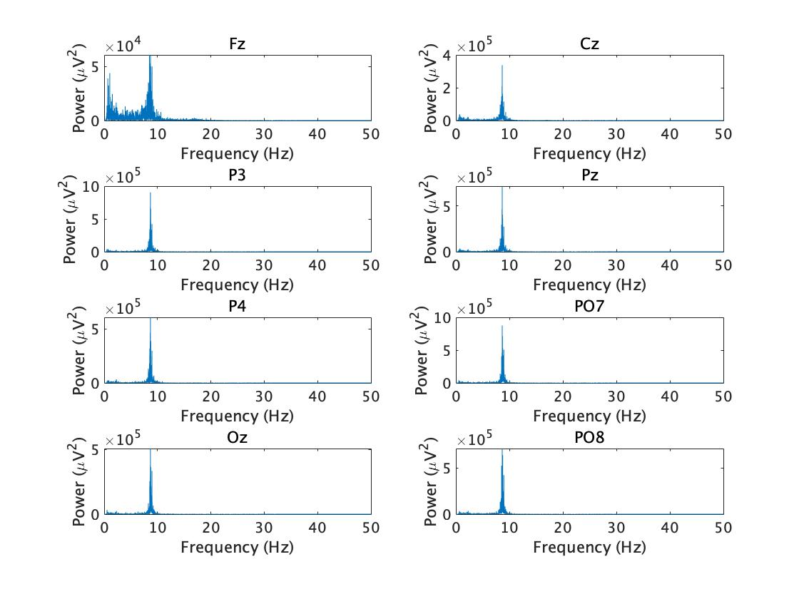

# Lecture3 2021-10-11

Spectrogram analysis of the closeEEG was performed with a window size of 1000 ms and a slide size of 250 ms.　
 

  
 
 
``` spectrogram.py
import numpy as np
import matplotlib.pyplot as plt
import pandas as pd
import scipy.io as io


if __name__ == "__main__":

    eeg_file = '../EEG-sample/close.mat'
    frame_size = 256
    frame_shift = 66
    out_plot = './image/spectrogram.png'
    data = io.loadmat(eeg_file)
    data = data['y']
    eeg_sample = data[1]
    print(eeg_sample)
    num_samples = len(eeg_sample)
    sample_frequency = 256

    # Convert milliseconds to number of sample
    frame_size = int(sample_frequency \
                     * frame_size * 0.001)
    # Convert milliseconds to number of amples
    frame_shift = int(sample_frequency * frame_shift * 0.001)

    fft_size = 1
    while fft_size < frame_size:
        fft_size *= 2

    # Calculate the total number of frames
    num_frames = (num_samples - frame_size) // frame_shift + 1
    # Prepare the spectrogram matrix
    spectrogram = np.zeros((num_frames, int(fft_size/2)+1))

    # Calculate the amptitude spectrum
    for frame_idx in range(num_frames):
        start_index = frame_idx * frame_shift

        frame = eeg_sample[start_index:start_index + frame_size].copy()
        frame = frame * np.hamming(frame_size)
        spectrum = np.fft.fft(frame, n=fft_size)
        absolute = np.abs(spectrum)
        absolute = absolute[:int(fft_size/2) + 1]
        log_absolute = np.log(absolute + 1E-7)
        spectrogram[frame_idx, :] = log_absolute

    # plotting
    plt.figure(figsize=(10, 10))
    plt.subplot(2, 1, 1)
    time_axis = np.arange(num_samples) / sample_frequency
    plt.plot(time_axis, eeg_sample)

    plt.title('closeEEG 1ch')
    plt.xlabel('Time [sec]')
    plt.ylabel('value')
    plt.xlim([0, num_samples / sample_frequency])

    plt.subplot(2, 1, 2)

    # Set the range of the color map.
    spectrogram -= np.max(spectrogram)
    vmax = np.abs(np.min(spectrogram)) * 0.0
    vmin = - np.abs(np.min(spectrogram)) * 0.7

    plt.imshow(spectrogram.T[-1::-1, :],
               extent=[0, num_samples / sample_frequency,
                       0, sample_frequency / 2],
               cmap='gray',
               vmax=vmax,
               vmin=vmin,
               aspect='auto')

    plt.title('spectrogram')
    plt.xlabel('Time [sec]')
    plt.ylabel('Frequency [Hz]')

    plt.savefig(out_plot)
```
[References: Pythonで学ぶ音声認識 機械学習実践シリーズ](https://www.amazon.co.jp/dp/429501138X/ref=cm_sw_r_tw_dp_TZK9K0H7NV2NR4SX3VDX)


## Task1 
 
 The 7ch of open-eeg shows frequencies of 0~3Hz in addition to 8~10Hz.  
 



``` task1.m
% task1

load('../EEG-sample/open.mat','y');
openEEG = y(:, 256*10+1:length(y))

load('../EEG-sample/close.mat','y');
closeEEG = y(:, 256*10+1:length(y))

figure;
close_alpha= powercalctask(closeEEG(:,1:256*120), 7, 1,'close');
open_alpha= powercalctask(openEEG(:,1:256*120), 7, 2, 'open');


function [power8_13] = powercalctask(EEG, Ch, num, opcl)
data = EEG(Ch+1,:);
fftdata= fft(data);
pow_fftdata= abs(fftdata).^2/length(fftdata);
freq= 0:256/(length(pow_fftdata)-1):256/2;
singlePow= [pow_fftdata(1), 2*pow_fftdata(2:length(freq))];
subplot(2,1,num);
plot(freq, singlePow);
xlabel('Frequency (Hz)');
ylabel('Power (\muV^2)');
title(opcl);
xlim([0,50]);
mini = find(freq<8, 1, 'last');
maxi = find(freq<13, 1, 'last');
power8_13 = sum(singlePow(mini+1:maxi))
end

```


## Task2 

Ch1 of open-eeg shows a wider range of frequencies than ch7.

  
 
``` task2.m

   
% task2

load('../EEG-sample/close.mat','y');
closeEEG = y(:, 256*10+1:length(y))

figure;
close7_alpha= powercalctask2(closeEEG(:,1:256*120), 7, 1,'close 7ch');
close1_alpha= powercalctask2(closeEEG(:,1:256*120), 1, 2, 'close 1ch');

function [power8_13] = powercalctask2(EEG, Ch, num, opcl)
data = EEG(Ch+1,:);
fftdata= fft(data);
pow_fftdata= abs(fftdata).^2/length(fftdata);
freq= 0:256/(length(pow_fftdata)-1):256/2;
singlePow= [pow_fftdata(1), 2*pow_fftdata(2:length(freq))];
subplot(2,1,num);
plot(freq, singlePow);
xlabel('Frequency (Hz)');
ylabel('Power (\muV^2)');
xlim([0,50]);
title(opcl);
mini = find(freq<8, 1, 'last');
maxi = find(freq<13, 1, 'last');
power8_13 = sum(singlePow(mini+1:maxi))
end

```

## Task3
  
 
``` task3.m
% task3

load('../EEG-sample/open.mat','y');
openEEG = y(:, 256*10+1:length(y))
load('../EEG-sample/close.mat','y');
closeEEG = y(:, 256*10+1:length(y))
Ch ={'Fz', 'Cz', 'P3', 'Pz', 'P4', 'PO7','Oz','PO8'};
figure;
for ii = 1:8
    close_alpha= powercalctask3(closeEEG(:,1:256*120), ii, ii, Ch{ii});
end


function [power8_13] = powercalctask3(EEG, Ch, num, opcl)
data = EEG(Ch+1,:);
fftdata= fft(data);
pow_fftdata= abs(fftdata).^2/length(fftdata);
freq= 0:256/(length(pow_fftdata)-1):256/2;
singlePow= [pow_fftdata(1), 2*pow_fftdata(2:length(freq))];
subplot(4,2,num);
plot(freq, singlePow);
xlabel('Frequency (Hz)');
ylabel('Power (\muV^2)');
xlim([0,50]);
title(opcl);
mini = find(freq<8, 1, 'last');
maxi = find(freq<13, 1, 'last');
power8_13 = sum(singlePow(mini+1:maxi))
end
```
