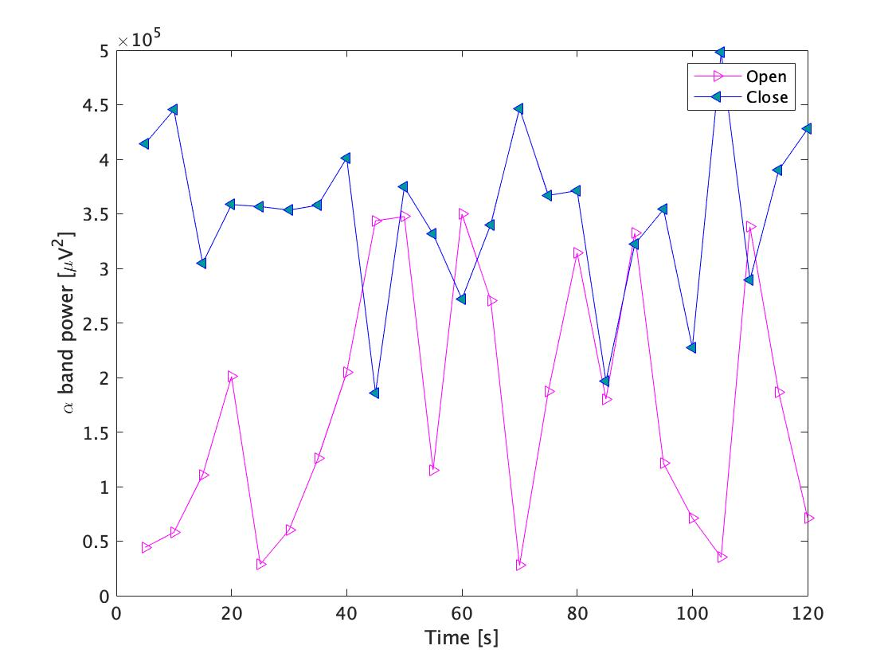
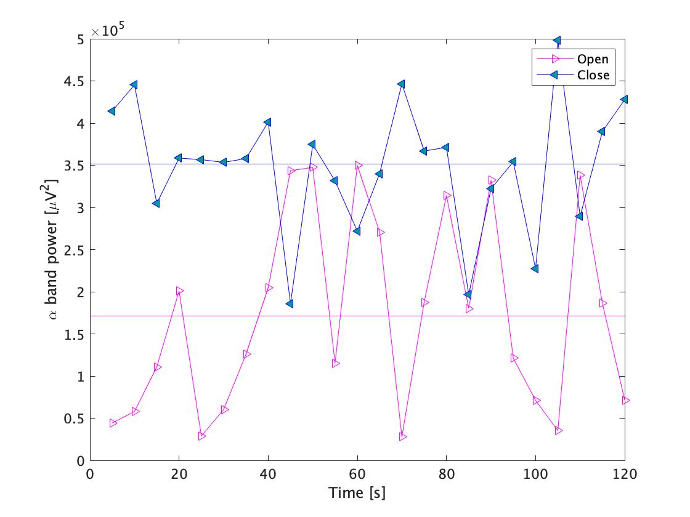
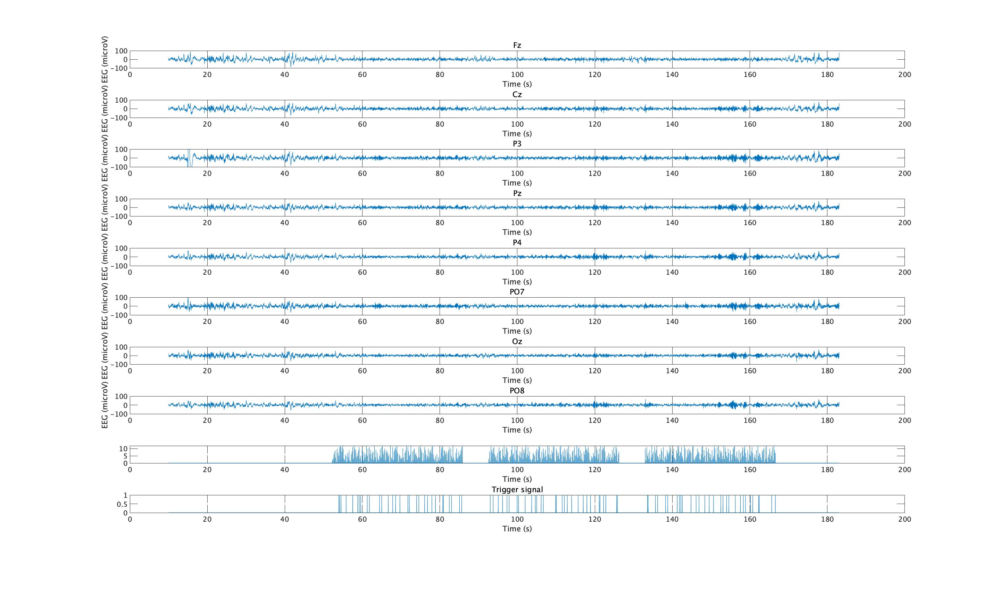

# Lecture4 2021-10-18


Task1では，　Channel7における，5秒毎のα帯の自発脳波スペクトル強度を示している．　　　
closeは左三角，openは右三角のマーカーを用いて，それぞれ示している．  

## Task1

  
 
 
``` task1.m
%% task1
load('../EEG-sample/open.mat','y');
openEEG = y(:, 256*10+1:length(y))

load('../EEG-sample/close.mat','y');
closeEEG = y(:, 256*10+1:length(y))

% Every 5 seconds
Datalength=5

o_power24 = powercalc_task1(openEEG, 7, Datalength);
c_power24 = powercalc_task1(closeEEG, 7, Datalength);

figure;
plot(Datalength:Datalength:120, o_power24, '->m');
hold on;
plot(Datalength:Datalength:120, c_power24, '-<b', 'MarkerFaceColor', [0 .6 .6]);
xlabel('Time [s]');
ylabel('\alpha band power [\muV^2]');
legend({'Open', 'Close'});

% Added more arguments
function [s_power] = powercalc_task1(EEG, Ch, Datalen)
original_data= EEG(Ch+1,:);
Fs = 256;
Period = 120;
minf= 8;
maxf= 13; 
s_power= zeros(1, fix(Period/Datalen)); 
freq= 0:Fs/(Datalen*Fs-1):Fs/2; 
mini = find(freq<minf, 1, 'last'); 
maxi = find(freq<maxf, 1, 'last'); 
for ii = 1:fix(Period/Datalen) 
    data = original_data(1, 1+Fs*(ii-1)*Datalen:Fs*ii*Datalen);
    fftdata = fft(data); 
    pow_fftdata = abs(fftdata).^2/length(fftdata); 
    singlePow = [pow_fftdata(1), 2*pow_fftdata(2:length(freq))];
    s_power(ii) = sum(singlePow(mini+1:maxi));
end
end
 
```


## Task2  
task2ではtask1のプログラムを用いてopenとcloseの違いを考察する．
また全体のパワー値を平均化した直線も示している．  
120点表示の際は振幅の揺れが激しくわかりずらかったが,Fig2にもある通り，全体を通じて，closeの方が振幅が大きくなっていることがわかる．  
このことから自発脳波を観測する際に，openよりもcloseの方がより大きいパワー値を示す傾向があることが読み取れる．  



``` task2.m

%% task2
load('../EEG-sample/open.mat','y');
openEEG = y(:, 256*10+1:length(y))
load('../EEG-sample/close.mat','y');
closeEEG = y(:, 256*10+1:length(y))

% Every 5 seconds
Datalength=5
o_power24 = powercalc_task1(openEEG, 7, Datalength);
c_power24 = powercalc_task1(closeEEG, 7, Datalength);

figure;
plot(Datalength:Datalength:120, o_power24, '->m');
hold on;
plot(Datalength:Datalength:120, c_power24, '-<b', 'MarkerFaceColor', [0 .6 .6]);
hold on;

Datalength=120
o_power1 = powercalc_task2(openEEG, 7, Datalength);
c_power1 = powercalc_task2(closeEEG, 7, Datalength);
yline(o_power1/24,'m')
hold on;
yline(c_power1/24,'b');
xlabel('Time [s]');
ylabel('\alpha band power [\muV^2]');
legend({'Open', 'Close'});

function [s_power] = powercalc_task1(EEG, Ch, Datalen)
original_data= EEG(Ch+1,:);
Fs = 256;
Period = 120;
minf= 8;
maxf= 13; 
s_power= zeros(1, fix(Period/Datalen)); 
freq= 0:Fs/(Datalen*Fs-1):Fs/2; 
mini = find(freq<minf, 1, 'last'); 
maxi = find(freq<maxf, 1, 'last'); 
for ii = 1:fix(Period/Datalen) 
    data = original_data(1, 1+Fs*(ii-1)*Datalen:Fs*ii*Datalen);
    fftdata = fft(data); 
    pow_fftdata = abs(fftdata).^2/length(fftdata); 
    singlePow = [pow_fftdata(1), 2*pow_fftdata(2:length(freq))];
    s_power(ii) = sum(singlePow(mini+1:maxi));
end
end

function [s_power] = powercalc_task2(EEG, Ch, Datalen)
original_data= EEG(Ch+1,:);
Fs = 256;
Period = 120;
minf= 8;
maxf= 13; 
s_power= zeros(1, fix(Period/Datalen)); 
freq= 0:Fs/(Datalen*Fs-1):Fs/2; 
mini = find(freq<minf, 1, 'last'); 
maxi = find(freq<maxf, 1, 'last'); 
for ii = 1:fix(Period/Datalen) 
    data = original_data(1, 1+Fs*(ii-1)*Datalen:Fs*ii*Datalen);
    fftdata = fft(data); 
    pow_fftdata = abs(fftdata).^2/length(fftdata); 
    singlePow = [pow_fftdata(1), 2*pow_fftdata(2:length(freq))];
    s_power(ii) = sum(singlePow(mini+1:maxi));
end
end

```


## Task3  

Fig3では誘発脳波をそれぞれ示す．　　  
9番目と10番目はそれぞれTrigger aignalを示している．  

  
 
``` task3.m

load P300
data = y(:, 256*10+1:length(y));
for ii = 1:10 % 全てのデータを描画する
    figure(1);
    subplot(10,1,ii);
    plot(data(1,:), data(ii+1,:));
    xlabel('Time (s)');
    if ii<9
        ylabel('EEG (microV)');
        title(Ch{ii});
        ylim([-100, 100]);
    elseif ii ==10
        title('Trigger signal');
    end

end


```

