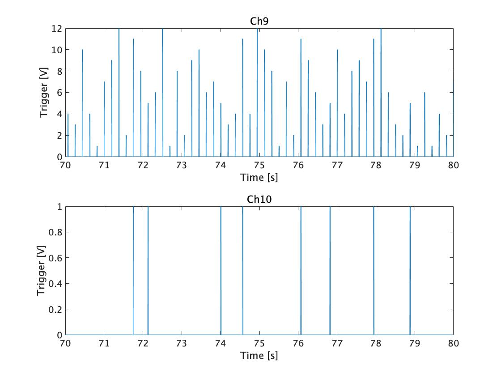

# Lecture5 2021-10-25

 

## Task1  

 P300.matのChannel９,10の70〜80秒間のトリガ信号を拡大し図示をした.  
 channel9と10はどちらもtrigger signalであり，  
 channel9はp300の実験において，コンピュータが画面に表示させ注目させた文字の行と列をそれぞれ表す.それぞれの値（v）は格行と列に対応しており,それらの中から本来は分析者がどの行列に被験者が興味を示しているか，
 またその文字を推測する．  
 またchannel10は教師データのようなもので，本来分析者がわからない被験者が注目するターゲットに対する行と列が反応したことを示すtrigger signalである．


  
 
 
``` task1.m
load P300
data = y(:, 256*10+1:length(y));
t70 = find(y(1,:) <= 70, 1, 'last');
t80 = find(y(1,:) <= 80, 1, 'last');
figure(1);
subplot(2,1,1);
plot(y(1, t70:t80), y(10, t70:t80));
title('Ch9');
xlabel('Time [s]');
ylabel('Trigger [V]');
subplot(2,1,2);
plot(y(1, t70:t80), y(11, t70:t80));
title('Ch10');
xlabel('Time [s]');
ylabel('Trigger [V]');

```


## Task2  
 
 task2ではターゲット刺激に対するトリガ信号を抽出し,lengthによって，ターゲット刺激のトリガの回数を計測した．  
 
``` output
ans =

    90

```

``` task2.m
%% task2
load P300
data = y(:, 256*10+1:length(y));

tdiff= [0, data(11, 2:length(data))-data(11, 1:length(data)-1)];
ttrig= find(tdiff> 0.8);

length(ttrig)

```


## Task3  
ノンターゲット刺激に対するトリガ信号を抽出し,こちらもlengthによって，ターゲット刺激のトリガの回数を計測した．   


``` output
ans =

   450

```
 
``` task3.m
%% task3
adiff= [0, data(10,2:length(data))-data(10,1:length(data)-1)];
atrig= find(adiff> 0.8);

flg= ismember(atrig, ttrig);
ntrig= atrig(~flg);

length(ntrig)

```
