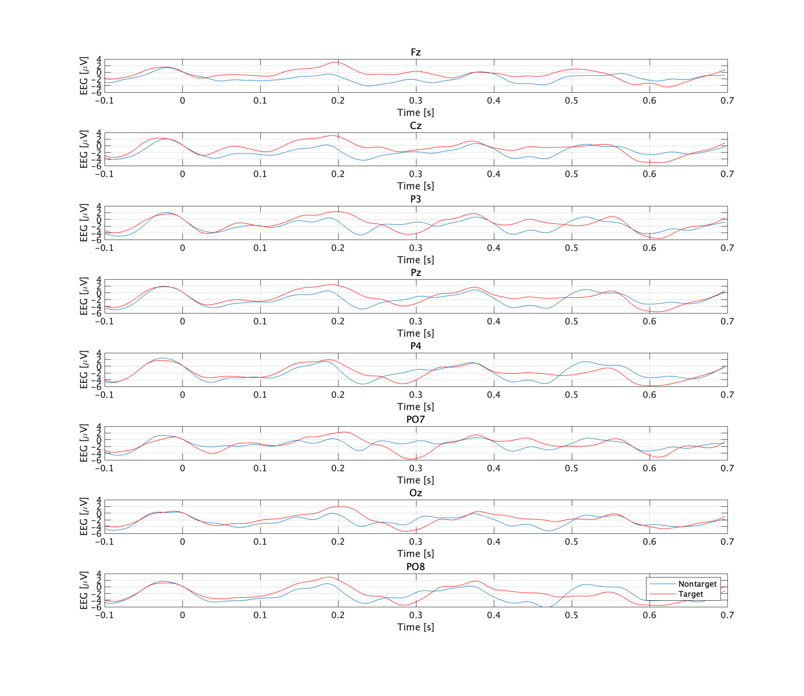
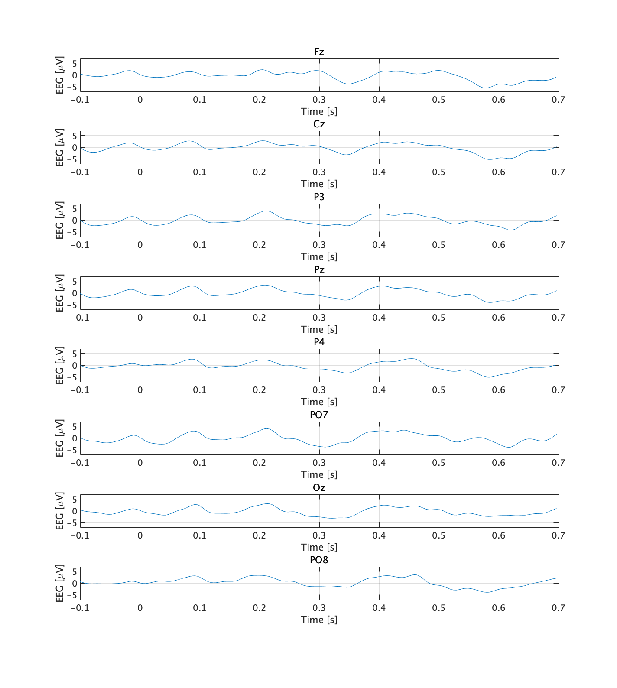

# Lecture5 2021-10-28

 

## Task1  


  
 
 
``` task1.m
%Task1

load P300
data = y(:, 256*10+1:length(y));

tdiff = [0, data(11, 2:length(data)) - data(11, 1:length(data) - 1)];
ttrig = find(tdiff > 0.8);
adiff = [0, data(10,2:length(data)) - data(10, 1:length(data) - 1)];
atrig = find(adiff > 0.8);
flg = ismember(atrig, ttrig);
ntrig = atrig(~flg);

TAR = average_wave(data, ttrig);
randorder = randperm(length(ntrig));
NTAR = average_wave(data, ntrig(randorder(1:length(ttrig))));
Channel = {'Fz','Cz','P3','Pz','P4','PO7','Oz','PO8'};
for ii = 1:8
    figure(1);
    subplot(8, 1, ii);
    plot(NTAR(1, :), NTAR(ii+1, :));
    hold on;
    plot(TAR(1, :), TAR(ii+1, :), 'r');
    grid on;
    axis([-0.1, 0.7, -6, 4]);
    xlabel('Time [s]');
    ylabel('EEG [\muV]');
    title(Channel{1, ii});
    hold off;
end
legend({'Nontarget', 'Target'});

function b_averaged= average_wave(data, trigger)
fs = 256;
NCh = 8;
before_time = 0.1;
after_time = 0.7;
tt = -1 * before_time: 1/fs : after_time;
Nave = length(trigger);
bef = round(before_time * fs);
aft = round(after_time * fs);
tmp = zeros(NCh, length(tt));
for ii = 1:Nave
    tmp= tmp+ data(2:NCh+1, trigger(ii) - bef:trigger(ii) + aft - 1);
end
averaged = tmp / Nave;
b_averaged = averaged - epmat(averaged(:, bef + 1), 1, length(averaged));
b_averaged = [tt; b_averaged];
end
```


## Task2  
 
  


``` task2.m
%Task2

load P300
data = y(:, 256*10+1:length(y));

tdiff = [0, data(11, 2:length(data)) - data(11, 1:length(data) - 1)];
ttrig = find(tdiff > 0.8);
adiff = [0, data(10,2:length(data)) - data(10, 1:length(data) - 1)];
atrig = find(adiff > 0.8);
flg = ismember(atrig, ttrig);
ntrig = atrig(~flg);

TAR = average_wave(data, ttrig);
randorder = randperm(length(ntrig));
NTAR = average_wave(data, ntrig(randorder(1:length(ttrig))));
Channel = {'Fz', 'Cz', 'P3', 'Pz', 'P4', 'PO7', 'Oz', 'PO8'};

DIFF = [TAR(1, :); TAR(2:9, :)-NTAR(2:9, :)];

for ii = 1:8
    figure(2); 
    subplot(8, 1, ii); 
    plot(DIFF(1,:), DIFF(ii+1,:));
    grid on; 
    axis([-0.1, 0.7, -7, 7]);
    xlabel('Time [s]'); 
    ylabel('EEG [\muV]');
    title(Channel{ii});
end

```
