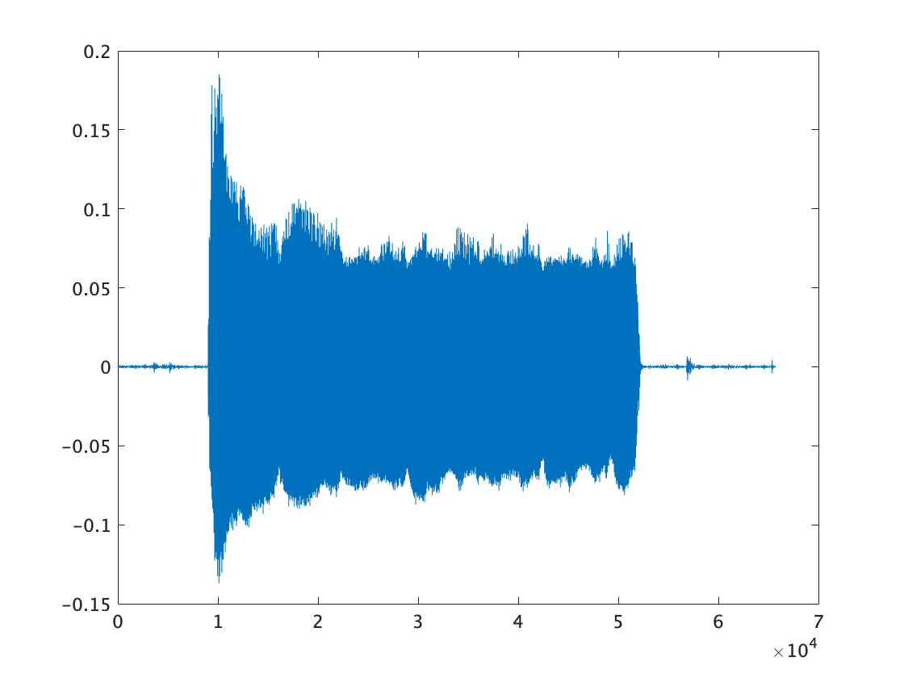
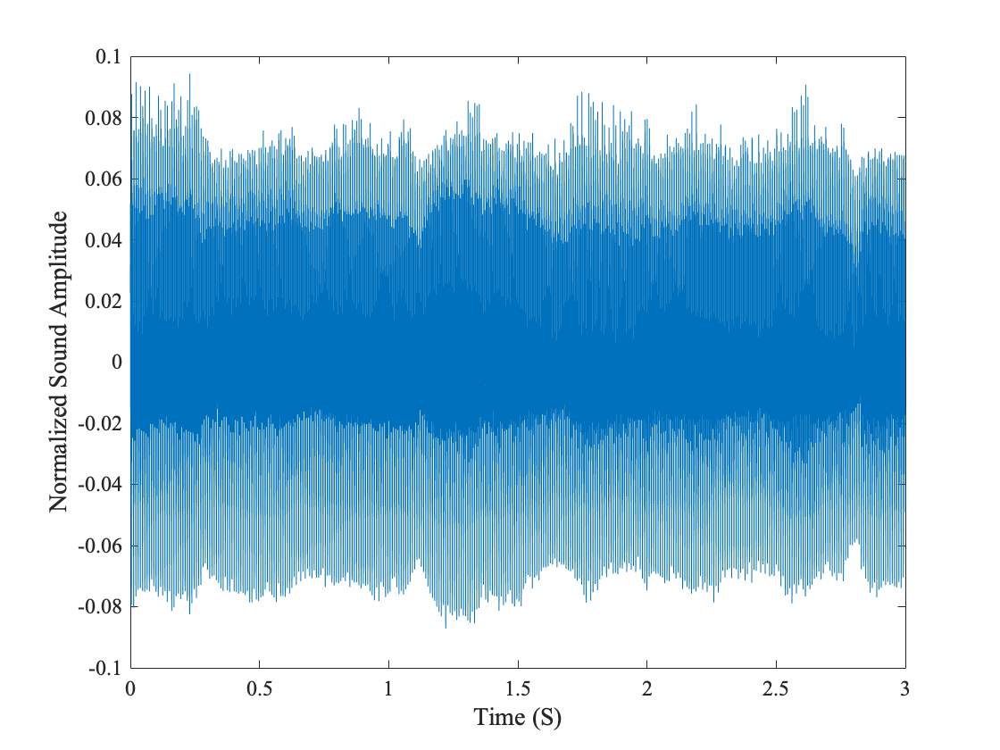
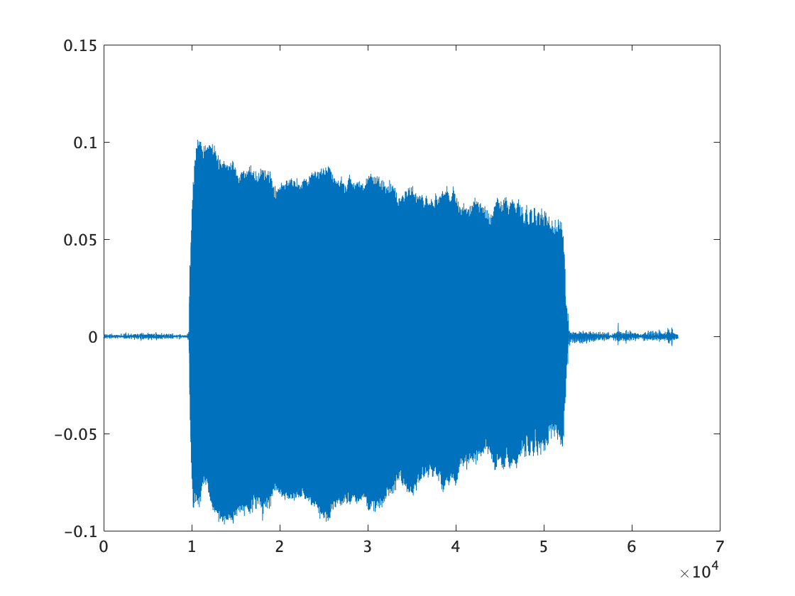
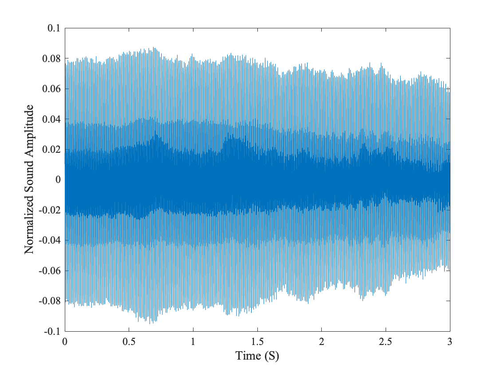
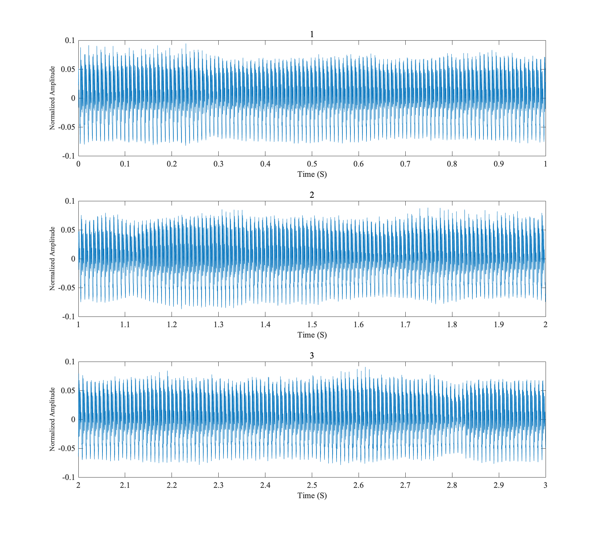
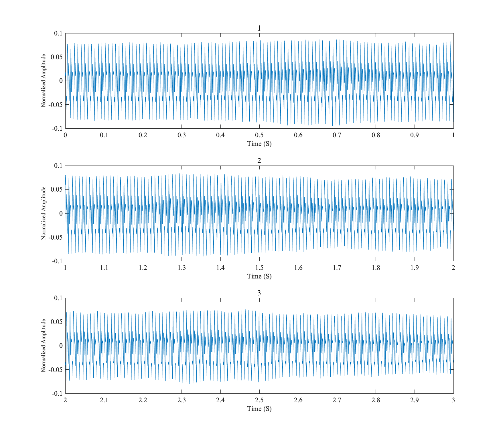

# Lecture7 2021-11-3

 

## Task1  


  
  
  

 
```task1.m
[data_a, fs_a]=audioread('hosei-retact-a.wav');
figure(1);
plot(data_a)

N=8000;
%20000-50000
x_a=data_a(20001:20000+3*N);
fs_a=8000;
dt=1/fs_a;
t=dt:dt:(3*N)*dt;
figure(2);
plot(t,x_a)
set(gca,'FontSize',12,'FontName','Times New Roman')
xlabel('Time (S)','FontSize',14)
ylabel('Normalized Sound Amplitude','FontSize',14)


[data_o, fs_o]=audioread('hosei-retact-o.wav');
figure(3);
plot(data_o)
N=8000;
%20000-50000

x_o=data_o(20001:20000+3*N);
fs_o=8000;
dt=1/fs_o;
t=dt:dt:(3*N)*dt;
figure(4);
plot(t,x_o)
set(gca,'FontSize',12,'FontName','Times New Roman')
xlabel('Time (S)','FontSize',14)
ylabel('Normalized Sound Amplitude','FontSize',14)
```


## Task2  
 
  

 figure5(aの発音をした時)では基本的に定常的な波形ではあるが，segment3がsegment1に比べ少し弱くなっており，波も安定していないように見える．また振幅の分布として全体的に上下のバランスが悪く，正の値の方が密度が高い
ように見える．時間が経つにつれて密度分布が変わっていないことから，この分布自体は音の性質(a)を表しているものなのではないかと考える．  
 
  

 figure6(oの発音をした時)もfigure5と同様に基本的に定常的な波形ではあるが，segment3がsegment1に比べ少し弱くなっており，波も安定していないように見える．また振幅の分布としても，全体的に上下のバランスが悪く，正の値の方が密度が高い
ように見えるがfigure5に比べ上下の差異はないように見える．この波形における密度分布が変わっていないことからも，この分布自体は音の性質(o)を表しているものなのではないかと考える．  
 
 
```task2.m
[data, fs]=audioread('hosei-retact-a.wav');
N=8000;
x=data(20001:20000+3*N);

N=8000; M=3; fs=8000 ; dt=1/fs ;
figure(1)
for m=1:M
    subplot(3,1,m); 
    t=(m-1)*N+1:m*N;
    time=t.*dt;
    plot(time, x((m-1)*N+1:m*N))
    set(gca,'FontSize',12,'FontName','Times New Roman')
    xlabel('Time (S)','FontSize',12)
    ylabel('Normalized Amplitude','FontSize',10)
    title(m);
end


[data, fs]=audioread('hosei-retact-o.wav');
N=8000;
x=data(20001:20000+3*N);

N=8000; M=3; fs=8000 ; dt=1/fs ;
figure(2)
for m=1:M
    subplot(3,1,m); 
    t=(m-1)*N+1:m*N;
    time=t.*dt;
    plot(time, x((m-1)*N+1:m*N))
    set(gca,'FontSize',12,'FontName','Times New Roman')
    xlabel('Time (S)','FontSize',12)
    ylabel('Normalized Amplitude','FontSize',10)
    title(m);
end

```
