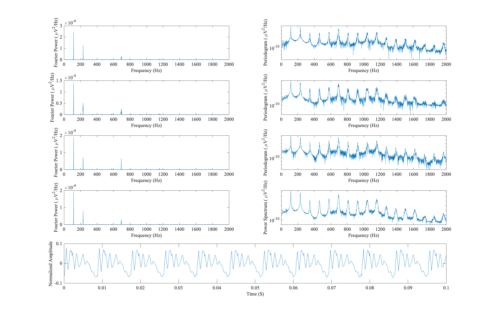
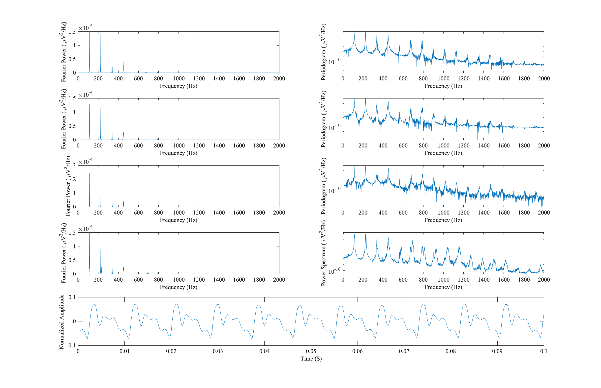

# Lecture8 2021-11-10

 今回taskで使用したコードとaとoの発音の際のそれぞれのデータの画像を以下にまとめて示す．
```matlab
N=8000;
M=3;
df=1/(N*dt);
f=df:df:2000*df;
P=zeros(2001,1);

for i=1:2
    if i==1
       [data, fs]=audioread('hosei-retact-a.wav');
    elseif i==2
       [data, fs]=audioread('hosei-retact-o.wav');
    end
    % task1
    x=data(20001:20000+3*N);
    figure(i)
    for m=1:M
    X=complex(zeros(2001,1),zeros(2001,1));
        for k=1:2001
            for n= (m-1)*N+1:m*N
                X(k)=X(k)+x(n)*exp(-sqrt(-1)*2*pi*(n-1)*(k-1)/N);
            end
            X(k)=X(k)*dt;
        end
    subplot(5,2,2*m-1); 
    X0=X.*conj(X)/(N*dt);
    plot(f,X0(2:2001))
    set(gca,'FontSize',12,'FontName','Times New Roman')
    xlabel('Frequency (Hz)','FontSize',12)
    ylabel('Fourier Power ( \muV^2/Hz)','FontSize',12)
    subplot(5,2,2*m); 
    X0=X.*conj(X)/(N*dt);
    semilogy(f,X0(2:2001))
    set(gca,'FontSize',12,'FontName','Times New Roman')
    xlabel('Frequency (Hz)','FontSize',12)
    ylabel('Periodogram ( \muV^2/Hz)','FontSize',12)
    P=P+X.*conj(X)/(N*dt);
    end

    P=P/M;
    subplot(5,2,7);
    plot(f,P(2:2001))
    set(gca,'FontSize',12,'FontName','Times New Roman')
    xlabel('Frequency (Hz)','FontSize',12)
    ylabel('Fourier Power ( \muV^2/Hz)','FontSize',12)
    subplot(5,2,8);
    semilogy(f,P(2:2001))
    set(gca,'FontSize',12,'FontName','Times New Roman')
    xlabel('Frequency (Hz)','FontSize',12)
    ylabel('Power Spectrum ( \muV^2/Hz)','FontSize',12)

    % task2
    [amax imax]=max(P(1:200))
    
    % task3
    t=dt:dt:800*dt;
    subplot(5,2,[9,10]);
    plot(t, x(16001:16000+800))
    set(gca,'FontSize',12,'FontName','Times New Roman')
    xlabel('Time (S)','FontSize',12)
    ylabel('Normalized Amplitude ','FontSize',12)
end

```
  
  

## Task1  
それぞれのセグメントと鹿さん平均された値を比較して，まず当たり前だが，加算平均された方のグラフは他のセグメントよりも滑らかになっていることがわかる．  
 またそれぞれのセグメントに比べ，ピーク周波数の違いはないが，それぞれのピークにおいて加算平均されたグラフの方が顕著に高低差を観察できることがわかる．   
 oの発音では500-600の間のピークがそれぞれのセグメントだと観察しづらいが加算平均のグラフだと明確に確認することができる．


## Task2  
 それぞれaとoのピッチ周波数は以下のように示される．
 
```output
>> task
hosei-retact-a.wav
amax =

   1.9354e-04


imax =

   117

hosei-retact-o.wav
amax =

   1.5134e-04


imax =

   114
```
## Task3  
aとoの発音をした際の短時間波形を比較すると， それぞれの大きな波形の周期はほとんど同じであることがわかる．また，task2でもホルツマン周波数のうちの最短のピークのピック周波数がほとんど同じであったことから
，aとoの発音による周波数の違いは出ないことがわかる．これは音の波長は音階によって生まれることが原因であるためだと考えられる．  
またaとoの発音を比較すると，大きな周期の中の細かい波形が大きく異なり，aの方が複雑でありoは滑らかな波形になっていることが図から読み取ることができる．
